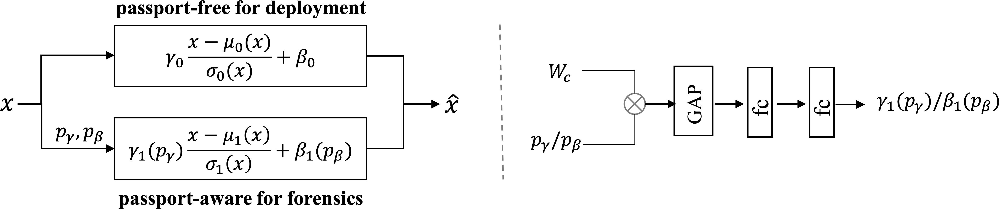

Passport-aware Normalization
=======


This repo is implementation for the accepted paper "Passport-aware Normalization for Deep Model Protection" (NeurIPS 2020).


<p align="center">     </p>
<p align="center"> Figure 1: Illustration of the proposed passport-aware normalization. </p>

The proposed Passport-aware Normalization is effective in both image and 3D point recognition models and robust against
different attacks, such as fine-tuning, model pruning and ambiguity attacks.


## Image Classification
In this task, we mainly refer to the settings mentioned in the baseline method "Rethinking Deep Neural Network Ownership Verification: Embedding Passports to Defeat Ambiguity Attacks"
 ([Code](https://kamwoh.github.io/DeepIPR/) | [Pepaer](https://arxiv.org/abs/1909.07830)).
 


### How to run

Take AlexNet on CIFAR10 as example, which is running on default arguments.
```
## cd Image_cls/Ours
```
#### Train a model with passport-aware normalization and triggers 
```
python train_v23.py -tb
```

#### Run Attacks

```
## Fine-tuning 
python train_v23.py -tb -tf
```

```
## Model pruning
python prun_v3.py
```

```
## Ambiguity attack I
python amb_attack_v3.py --type fake2
```

```
## Ambiguity attack II (10% flipped sign)
python amb_attack_v3.py --type fake3s  --flipperc 0.1
``` 

Experiment settings can be modified in  ./experiments/classification_private.py

Details about Passpor-aware Normalization can be found in ./models/layers/passportconv2d_private.py

## 3D Point Clouds Classification


### How to run
Take  [PointNet](http://openaccess.thecvf.com/content_cvpr_2017/papers/Qi_PointNet_Deep_Learning_CVPR_2017_paper.pdf) 
on [ModelNet](https://shapenet.cs.stanford.edu/media/modelnet40_normal_resampled.zip) as example:

```
## cd 3d_point_cls
```
#### Train a model with passport-aware normalization and triggers 
```
python train_3_cls.py 
```

#### Run Attacks

```
## Fine-tuning 
python fine_tune2.py
```

```
## Model pruning
python prun3.py
```

```
## Ambiguity attack I
python amb_attack.py --type fake2
```

```
## Ambiguity attack II (10% flipped sign)
python amb_attack.py --type fake3s  --flipperc 0.1
``` 

## Requirements
Python >= 3.6 <br>
Pytorch >= 1.1.0


## Reference By
[kamwoh/DeepIPR](https://github.com/kamwoh/DeepIPR)<br>
[yanx27/Pointnet_Pointnet2_pytorch](https://github.com/yanx27/Pointnet_Pointnet2_pytorch)


## Acknowledgement
This work was supported in part by the NSFC Grant U1636201, 62002334 and 62072421, Exploration Fund Project 
of University of Science and Technology of China under Grant YD3480002001, and by Fundamental Research Funds for the 
Central Universities under Grant WK2100000011, and Hong Kong ECS grant 21209119, Hong Kong UGC. Gang Hua is partially supported 
by National Key R\&D Program of China Grant 2018AAA0101400 and NSFC Grant 61629301. 


## Citation
If you find this work useful for your research, please cite
```
@inproceedings{Passport-aware Normalization,
  title={Passport-aware Normalization for Deep Model Protection},
  author={Jie Zhang, Dongdong Chen, Jing Liao, Weiming Zhang, Gang Hua, and  Nenghai Yu},
  booktitle={Advances in Neural Information Processing Systems (NeurIPS)},
  year={2020},
}
```

## License and Copyright
The project is open source under MIT license (see the ``` LICENSE ``` file).

